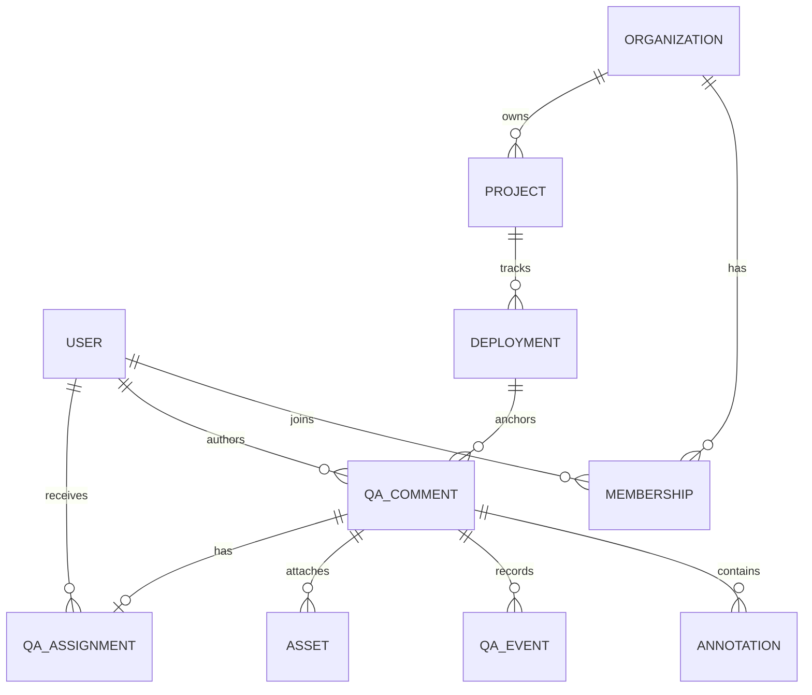

# 데이터 모델

## 핵심 관계



## 테이블

### identity

- `users(id, email, display_name, avatar_url, created_at)`
- `organizations(id, name, created_at)`
- `memberships(organization_id, user_id, role[admin|designer|developer|viewer])`
- `invites(id, organization_id, email, role, token_hash, expires_at, accepted_at, invited_by)`

초대 원문 token은 저장하지 않고 hash만 저장한다. 이메일 정규화와 `(organization_id, normalized_email)` unique 제약을 둔다.

### project/deployment

- `projects(id, organization_id, name, slug, vercel_project_id, allowed_origins[], created_at)`
- `deployments(id, project_id, provider, provider_deployment_id, immutable_url, production_alias, git_sha, git_ref, state, deployed_at, metadata_json)`

`(project_id, provider_deployment_id)`와 `(project_id, immutable_url)`은 unique다. 코멘트는 alias가 아니라 `deployments.id`를 참조한다.

### QA

- `qa_comments(id, project_id, deployment_id, author_id, title, body, type, priority, status, pathname, query_string, viewport_width, viewport_height, device_scale_factor, zoom, scroll_x, scroll_y, element_qa_id, element_key, selector_hint_json, element_rect_json, normalized_anchor_json, figma_node_url, created_at, updated_at, resolved_at)`
- `annotations(id, qa_comment_id, kind[pin|rect|arrow|path|text], geometry_json, style_json, z_index, created_at)`
- `qa_assignments(qa_comment_id, assignee_id, assigned_by, assigned_at)`
- `qa_events(id, qa_comment_id, actor_id, kind, from_status, to_status, payload_json, created_at)`
- `assets(id, qa_comment_id, kind[screenshot_authored|screenshot_replayed|figma_reference|diff], object_key, mime_type, width, height, sha256, capture_metadata_json, created_at)`
- `notifications(id, user_id, qa_comment_id, kind, read_at, created_at)`

### session/audit

- `qa_sessions(id, project_id, deployment_id, user_id, token_jti_hash, expires_at, revoked_at, created_at)`
- `audit_events(id, organization_id, actor_id, action, subject_type, subject_id, metadata_json, created_at)`

## enum과 규칙

- type: `visual`, `interaction`, `content`, `design_reference`
- priority: `low`, `medium`, `high`, `blocker`
- status: `open`, `in_progress`, `review_requested`, `done`
- 허용 transition:
  - `open -> in_progress`
  - `in_progress -> review_requested`
  - `review_requested -> done`
  - `review_requested -> in_progress`
  - `done -> open` (reopen event 필수)

상태 변경은 `qa_comments.status` 갱신과 `qa_events` 추가를 하나의 transaction으로 처리한다. 삭제 대신 archive를 우선하며, audit event는 append-only로 관리한다.

## geometry JSON 예

```json
{
  "space": "viewport-normalized",
  "x": 0.421,
  "y": 0.118,
  "width": 0.087,
  "height": 0.042
}
```

annotation은 normalized geometry를 권위 값으로 두고, 작성 당시 CSS pixel geometry를 capture metadata에 함께 보존한다.
