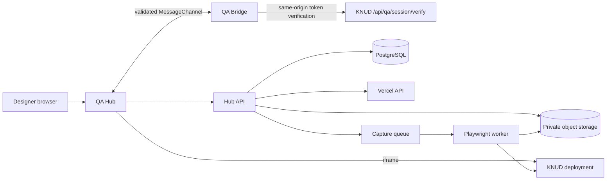

# KNUD Design QA Hub 기술 설계

## 1. 검토 결과

제품의 핵심 가치는 "스크린샷에 메모하기"가 아니라 **특정 배포본의 실행 상태를 다시 여는 것**이다. 따라서 코멘트의 기준 엔티티는 URL이 아니라 불변 `deployment`이며, 모든 코멘트는 deployment ID, immutable URL, Git SHA를 함께 가진다.

MVP에서 반드시 분리해야 할 경계는 다음과 같다.

1. **QA Hub**: 인증, 프로젝트/배포 선택, iframe 프레임, 주석 레이어, 코멘트 workflow, 알림, 재현 링크를 담당한다.
2. **QA Bridge**: 전시 사이트 번들에 포함되지만 기본적으로 휴면 상태다. 검증된 QA 세션에서만 경로·스크롤·요소·배포 정보를 전달한다.
3. **Capture worker**: URL/viewport/scroll을 Playwright로 재실행해 기준 스크린샷을 만든다. 작성 순간의 transient UI는 Bridge의 선택적 same-origin capture adapter로 보완한다.
4. **Postgres + object storage**: 구조화된 QA 데이터와 이미지 원본을 분리 저장한다.

기존 PRD와 UI 프롬프트 파일은 현재 작업공간 및 `Documents` 아래에서 발견되지 않았다. 이 문서는 사용자 메시지에 포함된 요구사항을 기준으로 작성했으며, 원본 문서를 받으면 gap review가 필요하다.

## 2. 권장 스택

- Web: Next.js App Router + React + TypeScript
- DB: PostgreSQL, Drizzle ORM(또는 팀 표준 ORM)
- 인증: 초대 전용 OIDC/email magic link. 가입 API는 초대 레코드를 반드시 소비한다.
- 파일: S3 호환 object storage, private bucket, 짧은 수명의 signed URL
- 작업 큐: managed queue + 별도 Playwright worker
- 배포: Hub는 Vercel, Playwright capture worker는 Render Background Worker
- 관측: 구조화 로그와 audit event. 세션 토큰, screenshot signed URL, Vercel token은 로그에서 제거한다.

MVP는 단일 프로젝트지만 스키마에는 `organization_id`, `project_id` 경계를 둔다. 나중에 프로젝트를 늘릴 때 권한 모델과 데이터 이관을 다시 만들지 않기 위함이다.

## 3. 런타임 구조

## 4. Bridge 보안 프로토콜

단순히 `?qa=true` 또는 부모 window 존재 여부로 활성화하면 안 된다.

1. Hub API가 1~5분 수명의 서명된 session token을 발급한다. claim은 `iss`, `aud=knud-qa-bridge`, `sub=userId`, `sid`, `projectId`, `deploymentId`, `deploymentOrigin`, `hubOrigin`, `exp`, `jti`를 포함한다.
2. iframe에는 토큰을 URL/query/localStorage로 넣지 않는다. Bridge는 휴면 listener만 등록한다.
3. Hub가 정확한 `targetOrigin`으로 `knud.qa/init` 메시지와 `MessagePort`를 보낸다.
4. Bridge는 `event.origin`, `event.source === parent`, payload schema를 확인한 뒤 대상 사이트의 same-origin 검증 endpoint에 token을 보낸다.
5. 검증 endpoint는 Hub 공개키로 서명·만료·audience를 확인하고 deployment origin/ID 및 Hub origin을 대조한다. 필요하면 `jti` 1회 사용 여부도 Hub에 introspection한다.
6. 성공 후에는 전달받은 `MessagePort`만 사용한다. 모든 메시지는 version, session ID, monotonic sequence를 포함한다.
7. 세션 만료, 페이지 unload, origin 변경 시 telemetry와 annotation mode를 즉시 해제한다.

Bridge는 일반 사용자에게 UI를 렌더링하지 않고 검증 전 DOM event를 가로채지 않는다. CSP의 `frame-ancestors`는 production에서 Hub origin만 허용하고, `X-Frame-Options: DENY/SAMEORIGIN`과 충돌하지 않게 KNUD 응답 헤더를 조정해야 한다.

## 5. 좌표와 요소 식별

좌표는 하나만 저장하지 않는다.

- `viewport_rect`: 작성 시 CSS pixel 기준 요소 rect
- `document_rect`: rect + scroll offset
- `normalized_point/rect`: viewport width/height에 대한 0~1 값
- `element_relative_point`: 요소 rect 내부 0~1 값
- `qa_id`: 사람이 관리하는 안정 ID (`data-qa-id`)
- `selector_hint`: `qa_id`가 없을 때 tag/role/accessible name/인접 qa-id를 조합한 비권위 힌트

DOM path나 `nth-child`는 재현의 마지막 fallback일 뿐 안정 ID로 취급하지 않는다. 반복 목록은 `data-qa-id="artwork-card"`와 별도 stable entity key를 같이 보낸다.

## 6. 스크린샷 전략

cross-origin parent는 iframe DOM과 픽셀을 직접 읽을 수 없다. 따라서 두 종류를 명시적으로 저장한다.

- `authored_state`: Bridge의 host-provided capture adapter가 현재 DOM을 캡처. same-origin 이미지에는 강하지만 WebGL, video, CORS asset에는 제한이 있다.
- `replayed_state`: Playwright worker가 immutable deployment URL, route, viewport, scroll, 재현 script로 다시 캡처. 픽셀은 안정적이지만 열린 메뉴 등 일시 상태는 재현 script가 필요하다.

MVP UI는 캡처 출처를 표시하고, 캡처 실패 시 코멘트 생성을 막지 않는다. 원본 이미지와 annotation vector(JSON)를 별도 저장해 주석을 다시 편집할 수 있게 한다.

## 7. 재현 링크

공유 링크는 `/qa/:commentId/reproduce` 형태의 Hub URL이다. 서버가 권한을 확인한 뒤 정확한 deployment를 로드하고 다음 순서로 복원한다.

1. CSS viewport와 zoom을 설정
2. pathname + query로 이동
3. Bridge ready 및 deployment SHA 일치 확인
4. scroll 좌표 복원
5. `data-qa-id` 요소를 찾고 rect drift를 계산
6. annotation overlay와 코멘트 패널 표시

요소를 못 찾거나 rect drift가 임계치를 넘으면 "정확히 재현됨"으로 표시하지 않고, 저장 스크린샷과 현재 상태를 나란히 보여준다.

## 8. 위협과 대응

| 위협 | 대응 |
| --- | --- |
| 악성 부모가 Bridge 호출 | exact origin + source + signed token + deployment binding |
| token 유출/재사용 | 짧은 TTL, URL 미포함, jti, 로그 redaction, 선택적 1회 introspection |
| 임의 URL을 worker가 열어 SSRF | 프로젝트 allowlist, DNS/IP 재검증, redirect 제한, private IP 차단 |
| 저장형 XSS 코멘트 | plain text 저장/렌더, 링크 sanitizer, CSP |
| 이미지 정보 유출 | private bucket, 권한 검사 후 짧은 signed URL |
| iframe clickjacking | KNUD `frame-ancestors`를 Hub origin으로 한정 |
| 타 프로젝트 데이터 접근 | 모든 query에 organization/project scope, object key도 scope 포함 |

## 9. 의도적으로 MVP에서 제외

- Figma pixel diff 및 plugin
- Agent 자동 판정
- Slack/email 외부 알림(초기에는 in-app 알림)
- 완전한 session replay
- 임의의 외부 사이트 지원

이 기능들은 core telemetry와 재현 정확도를 검증한 후 추가한다.
